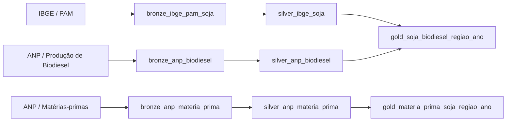
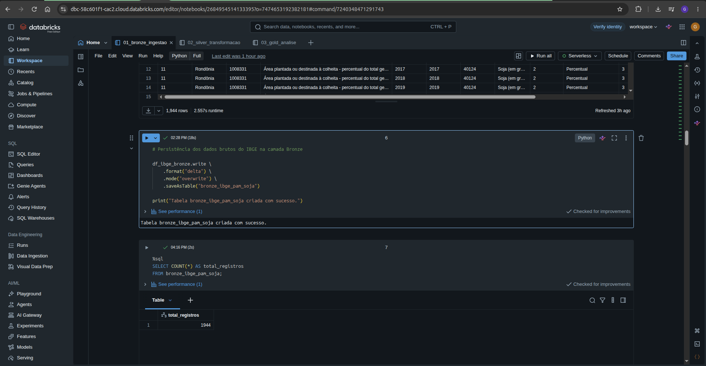
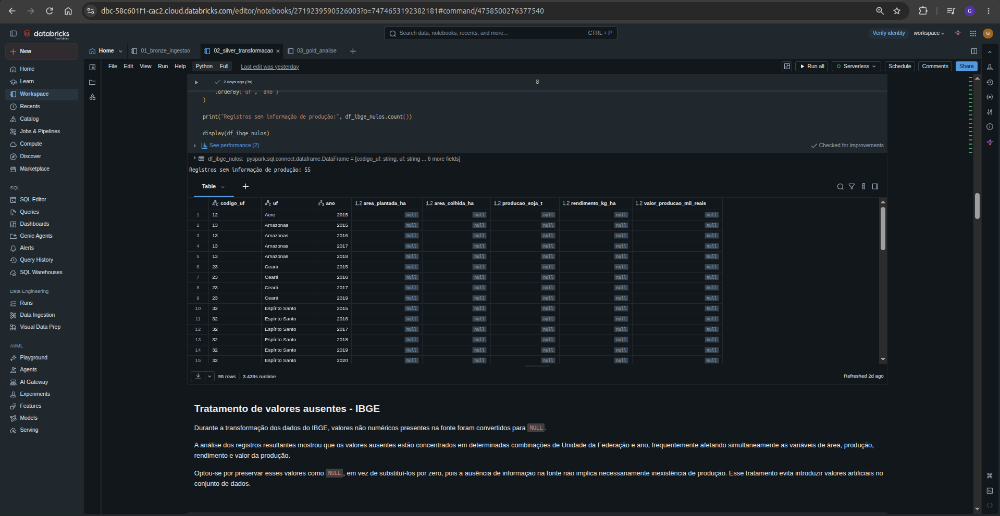
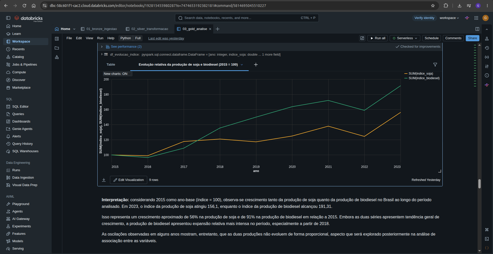
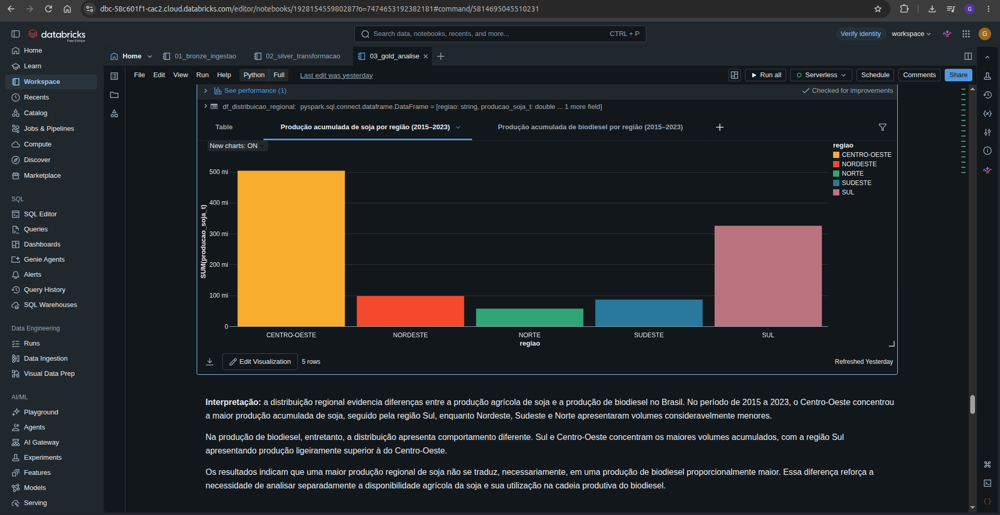
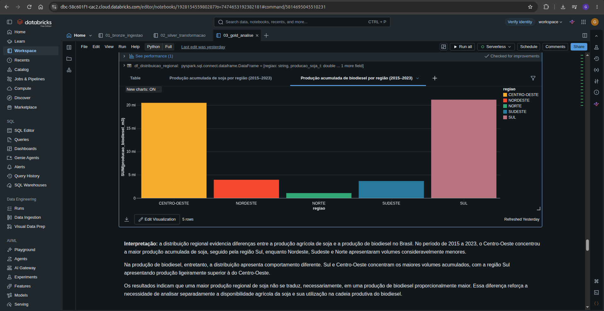
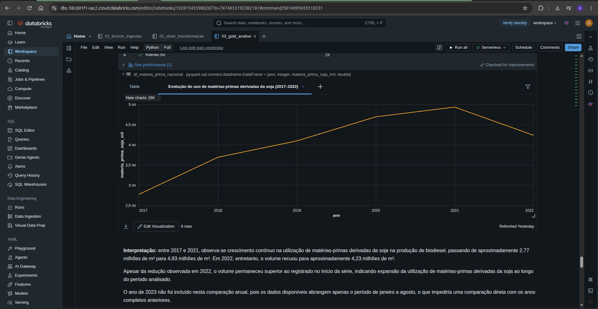
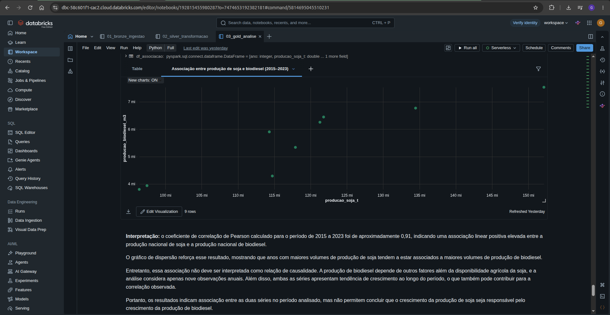

# MVP - Engenharia de Dados

## Contexto de Negócios e Perguntas

### Contexto

A soja possui papel relevante em diferentes cadeias produtivas brasileiras, sendo utilizada tanto na cadeia de alimentos quanto como matéria-prima para a produção de biodiesel. Dessa forma, o crescimento da produção agrícola de soja não implica necessariamente aumento proporcional de sua utilização para fins energéticos.

Considerando a importância do óleo de soja na produção brasileira de biodiesel, a integração de dados agrícolas e energéticos pode contribuir para compreender como a evolução da produção de soja se relaciona com sua utilização na cadeia de biodiesel ao longo do tempo e entre diferentes regiões do Brasil.

### Problema

Os dados sobre a produção agrícola de soja e sobre a cadeia produtiva do biodiesel são disponibilizados por fontes distintas e apresentam diferentes estruturas e granularidades.

Essa fragmentação dificulta a análise conjunta das informações e a avaliação da relação entre a disponibilidade agrícola da soja, sua utilização como matéria-prima e a produção de biodiesel no Brasil.

### Objetivo

Construir um pipeline de dados em nuvem para coletar, armazenar, tratar, integrar e disponibilizar dados públicos do IBGE e da ANP relacionados à produção de soja e à produção de biodiesel no Brasil.

O pipeline organizará os dados nas camadas Bronze, Silver e Gold, permitindo realizar análises históricas e regionais e investigar a relação entre a produção agrícola de soja e a cadeia produtiva do biodiesel.

### Perguntas de negócio

1. Como evoluíram a produção de soja e a produção de biodiesel no Brasil ao longo do período analisado?
2. Como a produção de soja e a produção de biodiesel estão distribuídas entre as regiões brasileiras?
3. Como evoluiu a utilização de matérias-primas derivadas da soja na produção de biodiesel?
4. Existe associação entre a produção agrícola de soja e a produção de biodiesel ao longo do período analisado?

## Carga dos Dados

Os dados utilizados neste projeto foram obtidos de fontes públicas oficiais e carregados no ambiente Databricks, utilizado como plataforma em nuvem para armazenamento e processamento dos dados.

Foram utilizadas três bases de dados:

- **IBGE/PAM:** dados da Produção Agrícola Municipal referentes à cultura da soja, contendo informações como área plantada, área colhida, quantidade produzida, rendimento médio e valor da produção.
- **ANP - Produção de biodiesel:** dados históricos da produção de biodiesel, contendo informações de período, região, unidade da federação, produtor e volume produzido.
- **ANP - Matérias-primas:** dados sobre as matérias-primas utilizadas na produção de biodiesel, contendo período, região, estado, tipo de matéria-prima e quantidade utilizada.

Os dados do IBGE foram obtidos por meio da API SIDRA, enquanto os dados da ANP foram obtidos a partir dos arquivos públicos disponibilizados pela agência.

- **Licença e condições de uso:** as bases utilizadas neste projeto são provenientes de órgãos públicos federais e disponibilizadas publicamente para consulta e reutilização. Os dados do IBGE/SIDRA são dados públicos de livre utilização, conforme a política federal de dados abertos. Os conjuntos da ANP utilizados no projeto são disponibilizados em sua seção de Dados Abertos, permitindo sua utilização e reutilização, observadas as condições de atribuição aplicáveis ao conteúdo publicado no portal gov.br. Neste MVP, os dados são utilizados exclusivamente para finalidade acadêmica, com identificação das respectivas fontes.

Após a coleta, os dados foram convertidos para DataFrames Spark e persistidos em tabelas Delta na camada Bronze:

- `bronze_ibge_pam_soja`
- `bronze_anp_biodiesel`
- `bronze_anp_materia_prima`

A camada Bronze preserva os dados próximos ao formato disponibilizado pelas fontes, realizando apenas os ajustes técnicos necessários para permitir sua persistência no ambiente. No caso dos arquivos da ANP, os nomes das colunas foram ajustados devido à presença de caracteres incompatíveis com a persistência padrão em tabelas Delta, sem alteração dos valores originais dos registros.

O período geral definido para a análise é de **2015 a 2023**. Entretanto, a base de matérias-primas da ANP possui registros disponíveis entre **janeiro de 2017 e agosto de 2023**. Essa diferença de cobertura temporal será considerada nas etapas de transformação e análise, sem realizar preenchimento artificial dos períodos ausentes.

## Modelagem e Catálogo de Dados

A arquitetura de dados do projeto foi estruturada seguindo o padrão Medallion, com organização dos dados nas camadas Bronze, Silver e Gold.

A camada **Bronze** armazena os dados provenientes das fontes externas em formato próximo ao original, preservando os registros coletados do IBGE e da ANP.

A camada **Silver** concentra as etapas de limpeza, padronização e transformação dos dados. Nessa etapa foram realizados ajustes de tipos, tratamento de caracteres, padronização das regiões brasileiras, seleção do período de análise e adequação das diferentes granularidades das fontes.

A camada **Gold** contém os dados preparados para consumo analítico. As informações agrícolas e energéticas foram agregadas por região e ano, possibilitando a integração entre a produção de soja e a produção de biodiesel. Também foi criada uma estrutura específica para análise das matérias-primas derivadas da soja utilizadas na produção de biodiesel.

### Modelo de dados

Para a camada Gold foi adotado um **modelo Flat por conceito**, mantendo em cada tabela os atributos necessários às análises sem a criação de dimensões e tabelas fato separadas.

Essa abordagem foi escolhida devido ao escopo analítico do MVP e à baixa complexidade das dimensões envolvidas. As principais análises utilizam as dimensões de ano e região, permitindo que os dados sejam organizados diretamente na granularidade necessária para responder às perguntas de negócio.

Dessa forma, foram definidos dois conceitos analíticos principais:

- **Produção de soja e biodiesel por região e ano:** integra os dados agrícolas do IBGE com os dados de produção de biodiesel da ANP.
- **Utilização de matérias-primas derivadas da soja por região e ano:** consolida os dados da ANP referentes às matérias-primas relacionadas à soja utilizadas na produção de biodiesel.

A adoção do modelo Flat evita a introdução de complexidade desnecessária para o escopo do projeto, mantendo as tabelas Gold simples e diretamente utilizáveis nas análises.

### Estrutura das camadas

| Camada | Tabela | Descrição |
| --- | --- | --- |
| Bronze | `bronze_ibge_pam_soja` | Dados brutos da Produção Agrícola Municipal referentes à soja. |
| Bronze | `bronze_anp_biodiesel` | Dados brutos da produção de biodiesel disponibilizados pela ANP. |
| Bronze | `bronze_anp_materia_prima` | Dados brutos das matérias-primas utilizadas na produção de biodiesel. |
| Silver | `silver_ibge_soja` | Dados da produção de soja tratados e organizados por unidade da federação e ano. |
| Silver | `silver_anp_biodiesel` | Dados da produção de biodiesel tratados e padronizados. |
| Silver | `silver_anp_materia_prima` | Dados das matérias-primas tratados, com período, região e produtos padronizados. |
| Gold | `gold_soja_biodiesel_regiao_ano` | Integração da produção de soja e da produção de biodiesel na granularidade região/ano. |
| Gold | `gold_materia_prima_soja_regiao_ano` | Quantidade de matérias-primas derivadas da soja utilizadas na produção de biodiesel, agregada por região e ano. |

### Linhagem dos dados

A linhagem dos dados foi estruturada de acordo com as etapas da arquitetura Medallion, permitindo rastrear a origem e as principais transformações realizadas até a disponibilização dos dados para análise.

Os dados do IBGE/PAM passam pelas etapas de ingestão e tratamento antes de serem agregados por região e ano. Os dados de produção de biodiesel da ANP seguem fluxo equivalente e são posteriormente integrados aos dados agrícolas pelas chaves `ano` e `regiao`, formando a tabela `gold_soja_biodiesel_regiao_ano`.

A base de matérias-primas da ANP segue um fluxo independente até a camada Gold. Nessa etapa são selecionados os registros relacionados à soja e os volumes são agregados por região e ano, originando a tabela `gold_materia_prima_soja_regiao_ano`.

### Catálogo de Dados

O catálogo a seguir documenta as tabelas das camadas Silver e Gold utilizadas no processamento e nas análises do projeto. Para cada atributo são apresentados o tipo de dado, sua descrição, unidade ou domínio quando aplicável e sua origem.

#### `silver_ibge_soja`

Tabela com os dados da produção agrícola de soja tratados e organizados na granularidade de unidade da federação e ano.

| Campo | Tipo | Descrição | Unidade / Domínio | Origem |
| --- | --- | --- | --- | --- |
| `codigo_uf` | string | Código da unidade da federação. | Código IBGE | IBGE/PAM |
| `uf` | string | Nome da unidade da federação. | UFs brasileiras | IBGE/PAM |
| `ano` | integer | Ano de referência da produção agrícola. | 2015–2023 | IBGE/PAM |
| `area_plantada_ha` | double | Área plantada ou destinada à colheita de soja. | hectares (ha) | IBGE/PAM |
| `area_colhida_ha` | double | Área efetivamente colhida de soja. | hectares (ha) | IBGE/PAM |
| `producao_soja_t` | double | Quantidade de soja produzida. | toneladas (t) | IBGE/PAM |
| `rendimento_kg_ha` | double | Rendimento médio da produção de soja. | kg/ha | IBGE/PAM |
| `valor_producao_mil_reais` | double | Valor da produção de soja. | mil reais | IBGE/PAM |
| `regiao` | string | Região brasileira correspondente à UF. | NORTE, NORDESTE, CENTRO-OESTE, SUDESTE, SUL | Derivado da UF |

#### `silver_anp_biodiesel`

Tabela contendo os registros de produção de biodiesel tratados e padronizados.

| Campo | Tipo | Descrição | Unidade / Domínio | Origem |
| --- | --- | --- | --- | --- |
| `ano` | long | Ano de referência da produção. | 2015–2023 | ANP |
| `mes` | string | Mês de referência da produção. | Mês | ANP |
| `regiao` | string | Região brasileira do produtor. | NORTE, NORDESTE, CENTRO-OESTE, SUDESTE, SUL | ANP |
| `uf` | string | Unidade da federação do produtor. | UF brasileira | ANP |
| `produtor` | string | Identificação do produtor de biodiesel. | Texto | ANP |
| `produto` | string | Produto registrado na base. | BIODIESEL | ANP |
| `producao_biodiesel` | double | Volume de biodiesel produzido no período. | m³ | ANP |

#### `silver_anp_materia_prima`

Tabela contendo os registros tratados das matérias-primas utilizadas na produção de biodiesel.

| Campo | Tipo | Descrição | Unidade / Domínio | Origem |
| --- | --- | --- | --- | --- |
| `data_competencia` | date | Data correspondente à competência do registro. | Data | Derivado do período informado pela ANP |
| `ano` | integer | Ano da competência. | 2017–2023 | Derivado de `data_competencia` |
| `mes` | integer | Mês da competência. | 1–12 | Derivado de `data_competencia` |
| `regiao` | string | Região brasileira associada ao registro. | NORTE, NORDESTE, CENTRO-OESTE, SUDESTE, SUL | ANP |
| `estado` | string | Estado associado ao registro. | Estados brasileiros | ANP |
| `produto` | string | Tipo de matéria-prima utilizada na produção de biodiesel. | Texto | ANP |
| `quantidade_m3` | double | Quantidade da matéria-prima utilizada. | m³ | ANP |

#### `gold_soja_biodiesel_regiao_ano`

Tabela analítica principal que integra a produção agrícola de soja e a produção de biodiesel na granularidade de região e ano.

| Campo | Tipo | Descrição | Unidade / Domínio | Origem / Linhagem |
| --- | --- | --- | --- | --- |
| `ano` | integer | Ano de referência da observação. | 2015–2023 | Silver IBGE + Silver ANP |
| `regiao` | string | Região brasileira da observação. | NORTE, NORDESTE, CENTRO-OESTE, SUDESTE, SUL | Silver IBGE + Silver ANP |
| `producao_soja_t` | double | Produção total de soja agregada por região e ano. | toneladas (t) | `silver_ibge_soja` |
| `producao_biodiesel_m3` | double | Produção total de biodiesel agregada por região e ano. | m³ | `silver_anp_biodiesel` |

#### `gold_materia_prima_soja_regiao_ano`

Tabela analítica contendo a utilização de matérias-primas derivadas da soja na produção de biodiesel, agregada por região e ano.

| Campo | Tipo | Descrição | Unidade / Domínio | Origem / Linhagem |
| --- | --- | --- | --- | --- |
| `ano` | integer | Ano de referência da utilização da matéria-prima. | 2017–2023 | `silver_anp_materia_prima` |
| `regiao` | string | Região brasileira associada à utilização da matéria-prima. | NORTE, NORDESTE, CENTRO-OESTE, SUDESTE, SUL | `silver_anp_materia_prima` |
| `materia_prima_soja_m3` | double | Quantidade agregada de matérias-primas derivadas da soja utilizadas na produção de biodiesel. | m³ | `silver_anp_materia_prima`, registros relacionados à soja |

## Pipeline de Dados

O pipeline foi desenvolvido em notebooks no Databricks utilizando PySpark e organizado de acordo com a arquitetura Medallion. O fluxo de processamento foi dividido em três etapas principais: ingestão dos dados na camada Bronze, tratamento e padronização na camada Silver e integração dos dados para consumo analítico na camada Gold.

### Camada Bronze

A camada Bronze representa a entrada dos dados no pipeline. Os dados provenientes do IBGE e da ANP foram coletados de suas fontes públicas, convertidos para DataFrames Spark e persistidos em tabelas Delta.

Nesta etapa foram criadas as seguintes tabelas:

- `bronze_ibge_pam_soja`
- `bronze_anp_biodiesel`
- `bronze_anp_materia_prima`

Os valores originais foram preservados sempre que possível. Foram realizados apenas ajustes técnicos necessários para a persistência, como a adequação dos nomes das colunas dos arquivos da ANP.

*Figura 1 — Persistência e validação dos dados brutos do IBGE/PAM na camada Bronze, armazenados em formato Delta. Fonte: elaboração própria no Databricks.*

### Camada Silver

Na camada Silver foram realizadas as transformações necessárias para padronizar os dados e prepará-los para integração e análise.

Na base do IBGE foram selecionadas as variáveis referentes à área plantada, área colhida, quantidade produzida, rendimento médio e valor da produção. Os dados foram filtrados para o período de 2015 a 2023 e reorganizados para que cada registro representasse uma combinação de unidade da federação e ano.

Valores não disponíveis na fonte foram convertidos para nulos, evitando sua interpretação como valores iguais a zero. Também foi adicionada a região brasileira correspondente a cada unidade da federação.

Na base de produção de biodiesel da ANP foram corrigidos problemas de codificação de caracteres, padronizados os nomes das regiões e unidades da federação e convertida a produção para tipo numérico. Os registros também foram filtrados para o período de 2015 a 2023.

Na base de matérias-primas da ANP, a competência mensal foi convertida para o tipo data, permitindo a criação dos atributos de ano e mês. Também foram corrigidos problemas de codificação de caracteres e padronizados os campos de região, estado, produto e quantidade.

Como resultado, foram criadas as tabelas:

- `silver_ibge_soja`
- `silver_anp_biodiesel`
- `silver_anp_materia_prima`

*Figura — Verificação e tratamento de valores ausentes nos dados do IBGE/PAM durante a transformação na camada Silver. Os valores indisponíveis na fonte foram preservados como `NULL`, evitando sua interpretação como valores iguais a zero. Fonte: elaboração própria no Databricks.*

### Camada Gold

A camada Gold foi construída para disponibilizar dados diretamente relacionados às perguntas de negócio.

A produção de soja foi agregada por região e ano a partir dos dados do IBGE. De forma equivalente, os registros da ANP foram agregados para obter a produção total de biodiesel por região e ano. Os dois conjuntos foram então integrados pelas dimensões `ano` e `regiao`, resultando na tabela:

- `gold_soja_biodiesel_regiao_ano`

Essa tabela possui granularidade de **região e ano** e permite comparar a evolução e a distribuição regional da produção de soja e biodiesel.

Também foi criada uma tabela específica para analisar a utilização de matérias-primas derivadas da soja. Os registros relacionados à soja foram selecionados na base de matérias-primas da ANP e agregados por região e ano, originando:

- `gold_materia_prima_soja_regiao_ano`

A segunda tabela Gold possui granularidade de **região e ano** e permite acompanhar a evolução da utilização de matérias-primas derivadas da soja na produção de biodiesel.

Dessa forma, o pipeline implementado pode ser resumido pelo fluxo:

`Fontes públicas (IBGE/ANP) → Bronze → Silver → Gold → Análises`

Os notebooks utilizados no desenvolvimento seguem a mesma separação lógica:

- `01_bronze_ingestao`: coleta, leitura e persistência dos dados brutos.
- `02_silver_transformacao`: limpeza, conversão de tipos, padronização e preparação dos dados.
- `03_gold_analise`: agregação, integração, construção das tabelas Gold e realização das análises relacionadas às perguntas de negócio.

## Qualidade de Dados

A qualidade dos dados foi avaliada durante as etapas de transformação e após a construção das tabelas analíticas, considerando principalmente completude, consistência, unicidade, acurácia e presença de valores potencialmente atípicos.

### Verificações e tratamentos na camada Silver

Durante o tratamento dos dados do IBGE, foram identificados valores não numéricos representados pelo caractere `-`, indicando ausência de informação na fonte. Esses valores foram convertidos para `NULL`, evitando interpretá-los incorretamente como produção ou área igual a zero.

Após a transformação, foram identificados valores nulos em alguns dos indicadores agrícolas. Esses registros foram mantidos, pois representam indisponibilidade da informação na fonte e não necessariamente ausência de produção. Dessa forma, não foi realizado preenchimento artificial dos valores ausentes.

Também foi verificada a correspondência entre as unidades da federação e as cinco regiões brasileiras após a inclusão do atributo `regiao`, não sendo identificadas UFs sem região associada.

Nos dados da ANP foram identificados problemas de codificação de caracteres nos arquivos originais. Os textos foram corrigidos e os campos de região, unidade da federação, estado e produto foram padronizados. As medidas de produção e quantidade também foram convertidas para tipos numéricos adequados.

Na base de matérias-primas, a competência foi convertida para o tipo data e validada quanto à cobertura temporal. Foram encontrados registros entre janeiro de 2017 e agosto de 2023, totalizando 80 competências mensais distintas. Essa característica foi preservada e considerada posteriormente nas análises, sem preenchimento dos períodos não disponíveis.

### Validação das tabelas Gold

Após a construção das tabelas Gold, foram realizadas novas verificações para avaliar se os dados estavam adequados às análises de negócio.

Na tabela `gold_soja_biodiesel_regiao_ano`, foram obtidos 45 registros, correspondentes às cinco regiões brasileiras durante os nove anos do período de 2015 a 2023. A combinação de `ano` e `regiao` apresentou 45 chaves distintas, confirmando a unicidade da granularidade definida.

Não foram identificados valores nulos nas medidas utilizadas nessa tabela, nem valores negativos para a produção de soja ou para a produção de biodiesel. Também foram confirmados nove anos distintos e cinco regiões, conforme esperado para o escopo definido.

As estatísticas descritivas indicaram diferenças relevantes de magnitude entre as observações regionais. Entretanto, os valores extremos foram mantidos, pois representam observações válidas das fontes oficiais e não foram identificados indícios de erro que justificassem sua remoção ou substituição.

Na tabela `gold_materia_prima_soja_regiao_ano`, foi mantida a cobertura temporal disponível na fonte da ANP. Como os dados de 2023 estão disponíveis apenas até agosto, as comparações anuais dessa variável consideram prioritariamente os anos completos de 2017 a 2022, evitando comparar um ano parcial diretamente com anos completos.

Dessa forma, os tratamentos realizados buscaram preservar os dados das fontes sempre que possível, corrigindo problemas técnicos de formato e padronização sem introduzir valores artificiais ou excluir observações válidas.

## Análise de Dados

As análises foram realizadas a partir das tabelas da camada Gold, utilizando dados agregados por ano e região. O objetivo foi responder às quatro perguntas de negócio definidas para o projeto, relacionando a produção agrícola de soja, a produção de biodiesel e a utilização de matérias-primas derivadas da soja.

### 1. Evolução da produção de soja e biodiesel no Brasil

Para analisar a evolução nacional, os dados regionais da tabela `gold_soja_biodiesel_regiao_ano` foram agregados por ano.

Entre 2015 e 2023, a produção de soja passou de aproximadamente **97,5 milhões de toneladas para 152,1 milhões de toneladas**, enquanto a produção de biodiesel passou de aproximadamente **3,94 milhões de m³ para 7,53 milhões de m³**.

Considerando 2015 como índice 100, a produção de soja atingiu aproximadamente **156,1** em 2023, enquanto a produção de biodiesel atingiu aproximadamente **191,3**. Isso representa um crescimento aproximado de **56% para a soja** e **91% para o biodiesel** no período.

Apesar da tendência geral de crescimento das duas séries, a evolução não ocorreu de forma proporcional. A produção de biodiesel apresentou crescimento relativo mais intenso, principalmente a partir de 2018, enquanto a produção de soja apresentou oscilações ao longo do período.

*Figura 1 — Evolução relativa da produção de soja e biodiesel no Brasil, considerando 2015 como índice-base 100. Fonte: elaboração própria a partir de dados do IBGE/PAM e ANP.*

**Resposta à pergunta 1:** tanto a produção de soja quanto a produção de biodiesel cresceram entre 2015 e 2023, porém em ritmos diferentes, com crescimento relativo mais acentuado da produção de biodiesel.

### 2. Distribuição regional da produção de soja e biodiesel

A análise regional mostra diferenças na distribuição das duas atividades no território brasileiro.

No acumulado do período analisado, o **Centro-Oeste apresenta o maior volume de produção de soja**, seguido pela região Sul. Para a produção de biodiesel, **Sul e Centro-Oeste concentram os maiores volumes**, com a região Sul apresentando produção acumulada de biodiesel ligeiramente superior.

Os resultados mostram que uma maior produção agrícola de soja em determinada região não implica necessariamente uma produção de biodiesel na mesma proporção. Isso é compatível com o fato de a soja possuir diferentes destinos econômicos e de a cadeia produtiva do biodiesel depender de outros fatores além da disponibilidade regional do grão.

*Figura 2 — Produção acumulada de soja por região entre 2015 e 2023. Fonte: elaboração própria a partir de dados do IBGE/PAM.*

*Figura 3 — Produção acumulada de biodiesel por região entre 2015 e 2023. Fonte: elaboração própria a partir de dados da ANP.*

**Resposta à pergunta 2:** a produção de soja está fortemente concentrada no Centro-Oeste e no Sul, enquanto a produção de biodiesel também se concentra nessas regiões, mas apresenta uma distribuição regional que não acompanha de forma diretamente proporcional a produção agrícola de soja.

### 3. Evolução das matérias-primas derivadas da soja

Para esta análise foram considerados os registros da ANP relacionados às matérias-primas derivadas da soja utilizadas na produção de biodiesel.

Como a base possui cobertura entre janeiro de 2017 e agosto de 2023, a comparação anual foi realizada utilizando prioritariamente os anos completos de **2017 a 2022**, evitando comparar diretamente o ano parcial de 2023 com os anos completos.

O volume agregado passou de aproximadamente **2,77 milhões de m³ em 2017** para **4,23 milhões de m³ em 2022**. Durante esse período ocorreu crescimento até 2021, quando o volume atingiu aproximadamente **4,93 milhões de m³**, seguido por redução em 2022.

Mesmo com a queda observada no último ano completo da série, o volume de 2022 permaneceu superior ao registrado no início do período analisado.

*Figura 4 — Evolução do uso de matérias-primas derivadas da soja na produção de biodiesel entre 2017 e 2022. Fonte: elaboração própria a partir de dados da ANP.*

**Resposta à pergunta 3:** a utilização de matérias-primas derivadas da soja apresentou crescimento entre 2017 e 2021, seguido por redução em 2022, permanecendo ainda acima do volume observado em 2017.

### 4. Associação entre produção de soja e produção de biodiesel

Para investigar a associação entre as duas séries, os dados foram agregados em nível nacional por ano e foi calculado o coeficiente de correlação de Pearson para o período de 2015 a 2023.

O coeficiente obtido foi de aproximadamente **0,91**, indicando uma associação linear positiva entre a produção nacional de soja e a produção nacional de biodiesel no período analisado.

Entretanto, esse resultado deve ser interpretado com cautela. A análise considera apenas **nove observações anuais** e ambas as séries apresentam tendência de crescimento ao longo do período, fator que também pode contribuir para a correlação observada.

Além disso, correlação não implica causalidade. A produção de soja possui diferentes destinos econômicos e o crescimento da produção de biodiesel depende de outros fatores que não foram modelados neste MVP.

*Figura 5 — Associação entre a produção nacional de soja e a produção nacional de biodiesel no período de 2015 a 2023. Fonte: elaboração própria a partir de dados do IBGE/PAM e da ANP.*

**Resposta à pergunta 4:** os dados apresentam uma associação positiva entre a produção de soja e a produção de biodiesel no período analisado, mas os resultados não permitem concluir que o aumento da produção de soja seja responsável pelo crescimento da produção de biodiesel.

## Autoavaliação

*Em desenvolvimento.*
